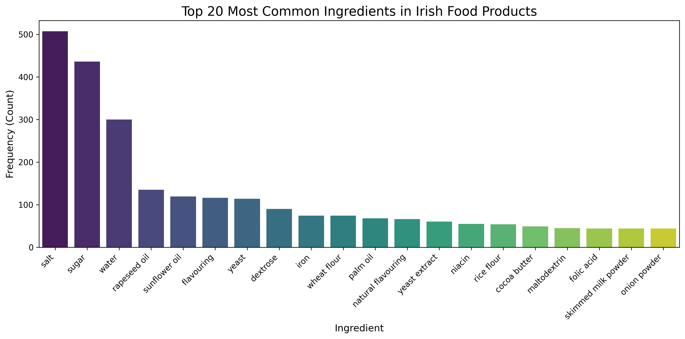

# 🇮🇪 Irish Food Market Analysis Pipeline

A full-stack Data Science pipeline that harvests, cleans, and analyses ingredient data from the OpenFoodFacts API, specifically targeting the Irish market.

*Fig 1: Analysis of the top 20 ingredients found in 1,000+ Irish food products.*

## 🎯 Project Overview
The goal of this project was to determine the "standard composition" of processed food sold in Ireland and to detect "Ultra-Processed" products automatically using Unsupervised Machine Learning.

## 🧠 Machine Learning: Unsupervised Clustering
I applied **TF-IDF Vectorization** and **K-Means Clustering** (k=5) to the raw ingredient text to see if the model could naturally segment the market without human labels.

**The Model successfully identified 5 distinct product categories:**

* **Cluster 0 (The "Bio-Active" Group):** Defined by keywords like *cultures, lactobacillus, yogurt*. The model separated "living" food from processed food.
* **Cluster 1 (Savory Ultra-Processed):** The largest cluster, containing chips, sauces, and processed meats. Defined by *oil, powder, extract, flavouring*.
* **Cluster 2 (Sweet Confectionery):** 90% Ultra-Processed. Defined by *cocoa, emulsifier, lecithin, palm oil*.
* **Cluster 3 (Vitamin-Fortified Cereals):** Distinguished by voluntary fortifications like *B12, Folic Acid, Riboflavin*.
* **Cluster 4 (Legally Fortified Bread):** Distinguished by mandatory additives in Irish flour: *Calcium Carbonate, Iron, Niacin*.

*Fig 2: Validation Heatmap. The AI-generated clusters (rows) strongly correlate with official NOVA processing groups (columns), proving the model correctly identified ultra-processed foods (NOVA 4) in Cluster 1 and 2.*

## 🛠 Tech Stack
* **Language:** Python 3.9
* **Database:** Supabase (PostgreSQL)
* **Machine Learning:** Scikit-Learn (K-Means, TF-IDF, PCA)
* **ETL & NLP:** Pandas, Regex Custom Tokenizer
* **Visualisation:** Seaborn, Matplotlib

## ⚙️ Pipeline Architecture

### 1. The Harvester (`harvest_to_db.py`)
* Iterates through 12 major food categories using API pagination.
* Filters specifically for products sold in `Ireland` or `en:ie`.
* Stores data in Supabase with upsert logic to prevent duplicates.

### 2. The Cleaner (`nlp_lab.py` logic)
* **Regex Tokenization:** Custom pattern `r',\s*(?![^()]*\))'` handles nested ingredient lists.
* **Normalisation:** Maps synonyms (e.g., *"Flavourings"* -> *"Flavouring"*) and removes German/non-English imports.

### 3. The Analyser (`analyse_irish_ingredients.py`)
* Calculates frequency distributions of ingredients.
* Identifies the "Industrial Standard": Salt and Sugar appear in >45% of products.

### 4. The Cluster Engine (`cluster_ingredients.py`)
* Converts text to high-dimensional vectors.
* Reduces dimensionality using PCA for visualisation.
* Validates clusters against the **NOVA** processing score.

## 🔮 Future Roadmap
* **Hypothesis Testing:** Conduct T-Tests to determine if "Vegan" labeled products have statistically higher sugar content than non-vegan equivalents.
* **Predictive Modelling:** Train a Random Forest classifier to predict Nutri-Score grades based solely on ingredient vectors.
