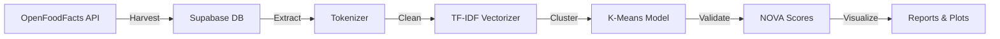

# Irish Food Market Analysis

[](https://python.org)
[](https://supabase.com)
[](https://scikit-learn.org)
[](https://opensource.org/licenses/MIT)

A full-stack **Data Science pipeline** that harvests, cleans, and analyzes ingredient data from the OpenFoodFacts API, specifically targeting the **Irish food market**. The project applies unsupervised machine learning to automatically detect ultra-processed foods.


*Analysis of the top 20 ingredients found in 1,000+ Irish food products.*

---

## 🎯 Project Overview

**Business Question:** *What is the "standard composition" of processed food sold in Ireland, and can we automatically detect ultra-processed products using Machine Learning?*

### Key Findings
- **Salt and Sugar** appear in **>45%** of all Irish food products
- K-Means clustering successfully identified **5 distinct product segments** without human labels
- AI-generated clusters strongly correlate with official NOVA processing scores (validated)

---

## 🧠 Machine Learning Results

Applied **TF-IDF Vectorization** + **K-Means Clustering** (k=5) to raw ingredient text:

| Cluster | Profile | Defining Keywords | NOVA Correlation |
|---------|---------|-------------------|------------------|
| 0 | Bio-Active Foods | *cultures, lactobacillus, yogurt* | NOVA 1-2 |
| 1 | Savory Ultra-Processed | *oil, powder, extract, flavouring* | NOVA 4 |
| 2 | Sweet Confectionery | *cocoa, emulsifier, lecithin, palm oil* | NOVA 4 |
| 3 | Vitamin-Fortified Cereals | *B12, folic acid, riboflavin* | NOVA 3-4 |
| 4 | Legally Fortified Bread | *calcium carbonate, iron, niacin* | NOVA 3 |


*Validation: AI clusters vs. official NOVA processing groups*

---

## 📁 Project Structure

```
Food_data/
├── src/                          # Core pipeline modules
│   ├── __init__.py
│   ├── harvester.py              # ETL: Fetch data from OpenFoodFacts API
│   ├── tokenizer.py              # NLP: Regex-based ingredient parser
│   ├── analyzer.py               # Stats: Frequency analysis & visualization
│   └── clustering.py             # ML: TF-IDF + K-Means clustering
│
├── notebooks/                    # Exploratory analysis
│   └── Food_market_analysis.ipynb
│
├── scripts/                      # Utility & exploration scripts
│   ├── check_api.py              # Test API connectivity
│   ├── search_api.py             # Search products by name
│   └── clean_countries.py        # Data cleaning utilities
│
├── outputs/                      # Generated visualizations
│   ├── irish_food_ingredients.png
│   ├── cluster_analysis.png
│   └── nova_validation.png
│
├── .github/
│   └── copilot-instructions.md   # AI agent context
│
├── requirements.txt              # Python dependencies
├── .env                          # Credentials (not tracked)
└── README.md
```

---

## 🛠️ Tech Stack

| Category | Technologies |
|----------|-------------|
| **Language** | Python 3.9+ |
| **Database** | Supabase (PostgreSQL) |
| **ML/NLP** | scikit-learn (K-Means, TF-IDF, PCA) |
| **Statistics** | Pingouin (t-tests, ANOVA) |
| **Visualization** | Seaborn, Matplotlib |
| **ETL** | Pandas, Requests |

---

## ⚡ Quick Start

### 1. Clone & Setup Environment

```bash
git clone https://github.com/yourusername/Food_data.git
cd Food_data

# Create virtual environment
python -m venv venv
source venv/bin/activate  # Windows: venv\Scripts\activate

# Install dependencies
pip install -r requirements.txt
```

### 2. Configure Credentials

Create a `.env` file in the project root:

```env
SUPABASE_URL=your_supabase_url
SUPABASE_KEY=your_supabase_anon_key
```

### 3. Run the Pipeline

```bash
# Harvest data from OpenFoodFacts API
python src/harvester.py

# Analyze ingredient frequencies
python src/analyzer.py

# Run ML clustering
python src/clustering.py
```

---

## 📊 Pipeline Architecture



### Stage Details

1. **Harvester** - Iterates 12 food categories, filters for Ireland, respects API rate limits
2. **Tokenizer** - Custom regex `r',\s*(?![^()]*\))'` handles nested ingredient lists
3. **Analyzer** - Normalizes synonyms, calculates frequencies, generates visualizations
4. **Clustering** - Converts text to vectors, reduces dimensions via PCA, validates against NOVA

---

## 🔬 Statistical Analysis

The notebook includes hypothesis testing using Welch's t-test:

- **Salt Content:** Soup vs. Crisps (significant difference, p < 0.05)
- **Sugar Analysis:** Cluster-based comparison of mean sugar levels

---

## 🔮 Future Roadmap

- [ ] **Predictive Model:** Train Random Forest to predict Nutri-Score from ingredients
- [ ] **Streamlit Dashboard:** Interactive web app for exploring clusters
- [ ] **Time-Series:** Track ingredient trends over time
- [ ] **Expand Markets:** Compare Ireland vs. UK vs. EU patterns

---

## 📄 License

This project is licensed under the MIT License - see the [LICENSE](LICENSE) file for details.

---

## 👤 Author

**Sean** - MSc Data Analytics Student

*This project demonstrates end-to-end data science skills: ETL pipelines, NLP preprocessing, unsupervised ML, statistical inference, and data visualization.*

---

<p align="center">
  <i>Built with ☕ and curiosity about what's really in our food.</i>
</p>
