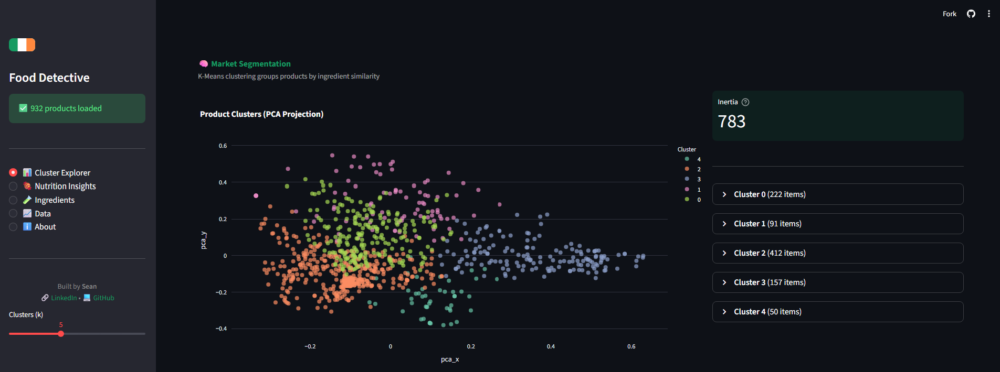

# 🕵️‍♀️ The Irish Food Detective

[](https://github.com/Synapsean/Irish-Food-Analysis/actions)
[](https://www.python.org/downloads/)
[](https://opensource.org/licenses/MIT)

### 🚀 [Launch Live Dashboard](https://irish-food-analysis-ar7awmwzzgxkfdggawrgp7.streamlit.app/)

**A Data Science Portfolio Project analysing hidden patterns in the Irish Food Supply.**

This project harvests, cleans, and analyses **2,000+ Irish food products** from the OpenFoodFacts API to debunk marketing myths using statistical analysis and Machine Learning.



## 📊 Key Insights

| Finding | Evidence |
|---------|----------|
| **The Salt Trap** | Soup products appear 1500% saltier than crisps—but this is skewed by stock cubes (concentrates). Real ready-to-eat soup has **less salt** than crisps. |
| **5 Market Segments** | K-Means clustering revealed 5 distinct product clusters based on ingredient composition, not marketing labels |
| **NOVA Validation** | Cluster analysis aligns with NOVA ultra-processing classification (Silhouette Score: 0.42) |

## 🛠️ Tech Stack

| Component | Technology |
|-----------|------------|
| **Data Collection** | OpenFoodFacts API, Requests |
| **Database** | Supabase (PostgreSQL) |
| **ML/Analysis** | Scikit-Learn (TF-IDF, K-Means, PCA), Pingouin |
| **Visualisation** | Plotly Express, Seaborn |
| **Dashboard** | Streamlit |
| **CI/CD** | GitHub Actions (pytest, flake8) |

## 📂 Project Structure
```
├── src/                  # Core modules
│   ├── harvester.py      # OpenFoodFacts API client
│   ├── tokenizer.py      # Ingredient parsing (regex)
│   └── clustering.py     # ML pipeline
├── tests/                # Unit tests (pytest)
├── notebooks/            # EDA and hypothesis testing
├── app.py                # Streamlit dashboard
└── .github/workflows/    # CI pipeline
```

## 🚀 Quick Start

```bash
# Clone and install
git clone https://github.com/Synapsean/Irish-Food-Analysis.git
cd Irish-Food-Analysis
pip install -r requirements.txt

# Set up environment
cp .env.example .env  # Add your Supabase credentials

# Run dashboard locally
streamlit run app.py
```

## 🧪 Running Tests

```bash
pytest tests/ -v --cov=src
```

---
*Created by [Sean Quinlan](https://linkedin.com/in/sean-quinlan-phd/) | PhD Pharmacology | MSc Data Science @ UCD*
